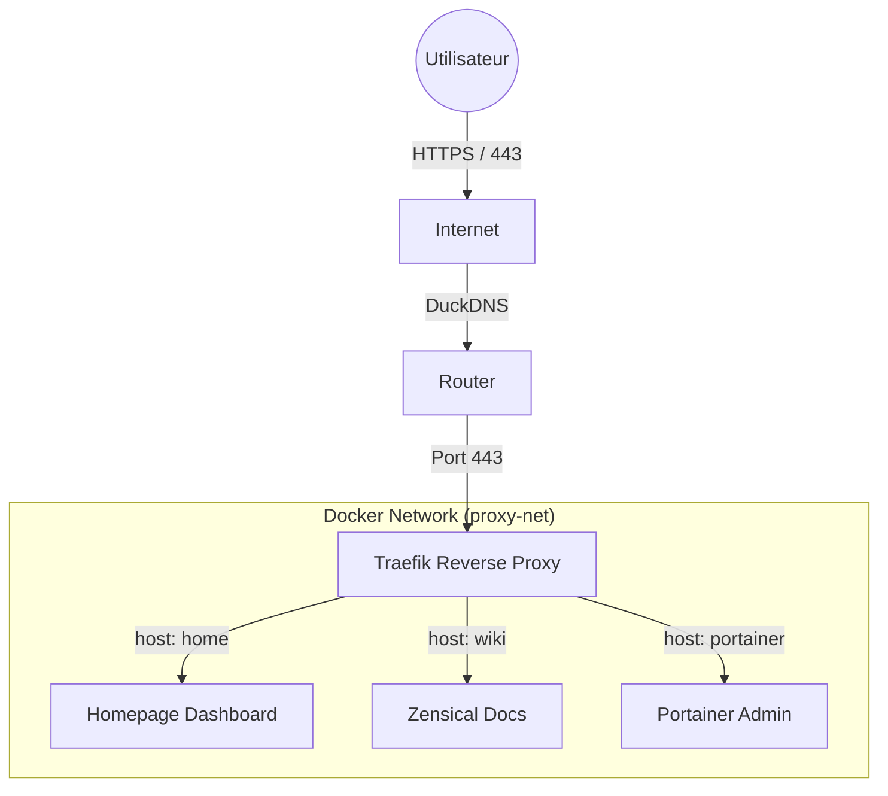

# projet_m431_wiki
# 🚀 Student Dashboard & Infrastructure (Projet M431)


Ce projet propose une infrastructure conteneurisée complète visant à fournir aux étudiants en informatique une plateforme centralisée. Elle regroupe un tableau de bord (emploi du temps, outils), une documentation technique (Wiki) et une interface de gestion serveur, le tout sécurisé automatiquement via HTTPS.

---

## 🏗️ Architecture

Le projet repose sur **Docker Compose** et utilise **Traefik** comme Reverse Proxy pour gérer le routage et la sécurité SSL (Let's Encrypt) automatiquement.



## ✨ Fonctionnalités

* **🌐 Accès Unique :** Un seul point d'entrée pour tous les services via sous-domaines.
* **🔒 Sécurité :** Certificats SSL/TLS automatiques (Let's Encrypt) via DuckDNS.
* **📊 Dashboard (Homepage) :** Vue d'ensemble (Météo, Ressources Docker, Raccourcis étudiants).
* **📚 Documentation (Zensical) :** Wiki pour les commandes et procédures techniques.
* **⚙️ Administration (Portainer) :** Gestion visuelle des conteneurs et volumes.

---

## 🛠️ Prérequis

* Un serveur Linux (Raspberry Pi, VPS, ou VM).
* [Docker](https://docs.docker.com/get-docker/) et [Docker Compose](https://docs.docker.com/compose/install/) installés.
* Un nom de domaine (ou un compte [DuckDNS](https://www.duckdns.org/)).
* Les ports `80` et `443` ouverts sur votre routeur.

---

## 🚀 Installation Rapide

### 1. Cloner le dépôt

```bash
git clone [https://github.com/Snaky21/projet_m431.git](https://github.com/Snaky21/projet_m431.git)
cd projet_m431

```

### 2. Configuration des secrets

⚠️ **Important :** Ne jamais commiter le fichier `.env` sur GitHub.
Dupliquez le fichier d'exemple et remplissez vos informations :

```bash
cp .env.example .env
nano .env

```

**Variables clés à modifier dans `.env` :**

* `DUCKDNS_TOKEN` : Votre token secret DuckDNS.
* `ACME_EMAIL` : Votre email pour les certificats SSL.
* `DOMAIN_NAME` : Votre domaine racine (ex: `mon-projet.duckdns.org`).

### 3. Démarrage

Lancez l'ensemble de la stack en arrière-plan :

```bash
docker compose up -d

```

---

## 📂 Structure du Projet

```text
.
├── docker-compose.yml    # Orchestration des services
├── .env                  # Variables d'environnement (NON INCLUS DANS GIT)
├── .env.example          # Modèle pour les variables
├── config/               # Fichiers de configuration (Homepage, Traefik)
├── docs/                 # Contenu Markdown du Wiki (Zensical)
└── images/               # Assets graphiques

```

---

## 🔗 Accès aux Services

Une fois démarré, les services sont accessibles via les URLs configurées :

| Service | URL Publique (Exemple) | URL Locale | Description |
| --- | --- | --- | --- |
| **Homepage** | `https://home.ton-domaine.duckdns.org` | `http://localhost:3000` | Portail principal |
| **Wiki** | `https://wiki.ton-domaine.duckdns.org` | `http://localhost:8000` | Documentation |
| **Portainer** | `https://portainer.ton-domaine.duckdns.org` | `http://localhost:9000` | Gestion Docker |
| **Traefik** | `https://traefik.ton-domaine.duckdns.org` | *Port 8080 (désactivé)* | Dashboard Routing |

---

## 📝 Commandes Utiles

**Voir les logs en temps réel :**

```bash
docker compose logs -f

```

**Mettre à jour les conteneurs :**

```bash
docker compose pull
docker compose up -d

```

**Arrêter la stack :**

```bash
docker compose down

```

---

## 👤 Auteur

**Gabriel** / **Jonathan** / **Kévin** / **Rafael**

* Projet réalisé dans le cadre du module M431.
