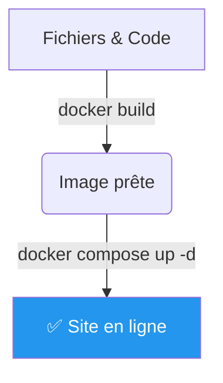
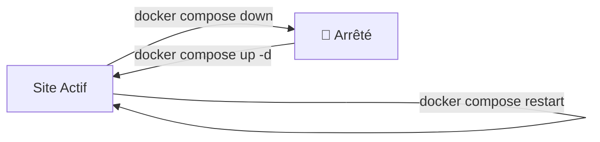

# 🚀 Docker : Le Guide Pratique (Pas à Pas)

Au lieu de longues théories, voici comment utiliser Docker concrètement pour ton projet, en suivant l'ordre logique de tes commandes.

## Étape 1 : Préparer le terrain (Commandes Système) 📂

Avant de toucher à Docker, il faut créer l'espace de travail sur ton Raspberry Pi.

1.  **`mkdir nom_dossier`** : Tu crées le dossier de ton projet.
2.  **`cd nom_dossier`** : Tu entres dedans pour travailler.
3.  **`touch nom_fichier`** : Tu crées les fichiers vides (comme le `Dockerfile` ou le `docker-compose.yml`) qui serviront à configurer Docker.

---

## Étape 2 : Construire ton application 🏗️

Une fois tes fichiers prêts (ton code), il faut les transformer en une "Image" Docker (le logiciel prêt à l'emploi).

* **`docker build -t nom_image .`** : Cette commande lit ton code et fabrique l'image.
* *-t* : permet de donner un nom (tag) à ton image pour la retrouver.

---

## Étape 3 : Lancer le projet (Le cœur du sujet) ▶️

C'est ici que la magie opère. On utilise généralement "Docker Compose" pour tout lancer d'un coup.

* **`docker compose up -d`** : Docker lit ton fichier de configuration et lance les conteneurs.
* *-d (detached)* : C'est crucial ! Ça permet de lancer le tout en "arrière-plan". Tu récupères la main sur ton terminal pendant que le site tourne.

---

## Étape 4 : Vérifier que ça marche 👀

Ton site tourne, mais tu veux en être sûr.

1. **`docker ps`** : Affiche la liste des conteneurs (containers) actifs. Si tu vois ton site ici, c'est gagné.
2. **`docker images`** : Affiche la liste des images stockées sur ton disque (celles que tu as construites avec `build`).

---

## Étape 5 : Gérer le quotidien (Maintenance) 🛠️

Tu as besoin de faire une modification ou d'éteindre le Raspberry Pi ?

* **`docker compose down`** : Arrête et supprime les conteneurs proprement. C'est le bouton "Off".
* **`docker compose restart`** : Relance les conteneurs (utile si tu as planté le site ou changé une petite config).

### Résumé visuel du cycle de vie :

---
### **Retour en arrière ->** [Homepage](https://github.com/Snaky21/projet-m431.git)