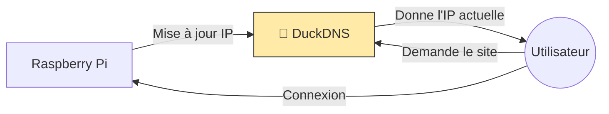
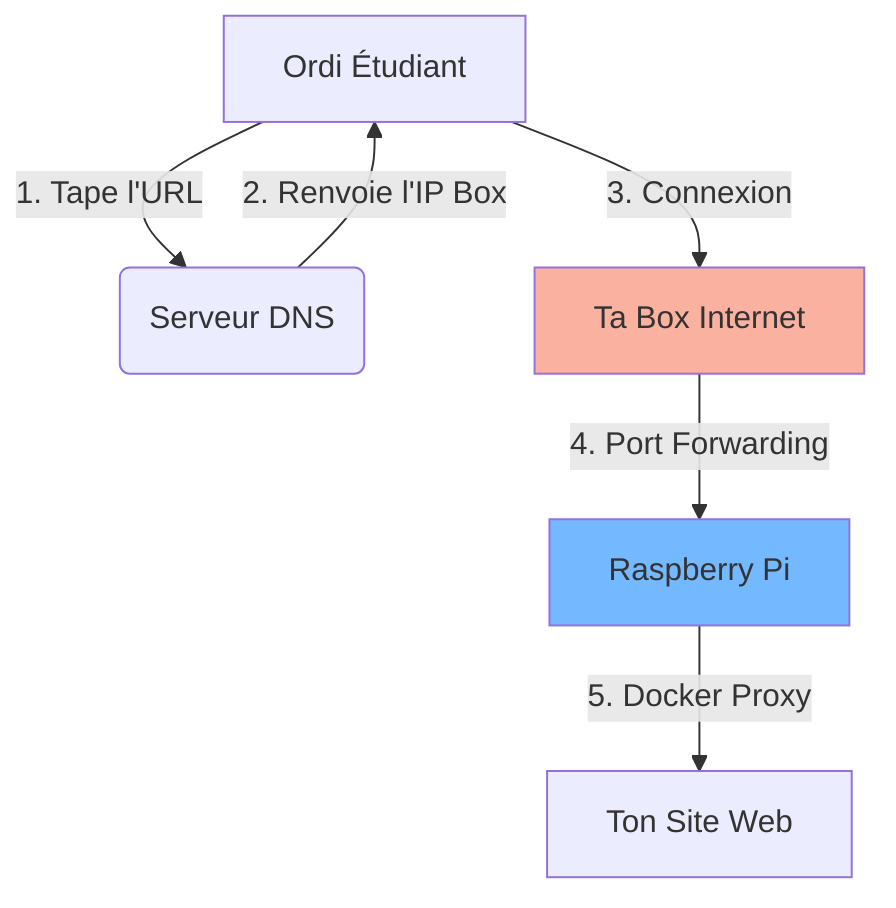

# 🌍 Gestion DNS : L'Annuaire d'Internet

Pour accéder à ton projet depuis l'extérieur sans retenir une suite de chiffres compliqués (IP), nous utilisons le DNS (Domain Name System).

## Étape 1 : Le Problème (L'IP Dynamique) 😫

Ton adresse IP publique (celle de ta box internet à la maison) est comme ton adresse postale. Mais chez la plupart des opérateurs, cette adresse change de temps en temps.

* Aujourd'hui tu habites au `80.12.34.56`.
* Demain tu habites au `90.23.45.67`.
* **Problème :** Impossible de donner une adresse fiable à tes utilisateurs.

---

## Étape 2 : La Solution (DuckDNS / Nom de domaine) 🦆

On utilise un service de "DNS Dynamique" (comme DuckDNS). C'est un robot qui fait le lien.

1.  Ton Raspberry Pi contacte DuckDNS toutes les 5 minutes : *"Eh, je suis ici maintenant !"*.
2.  DuckDNS met à jour ton nom : `mon-projet.duckdns.org`.
3.  L'utilisateur tape le nom, il arrive toujours chez toi, même si ton IP change.

---

## Étape 3 : La Redirection (Le Port Forwarding) 🚪

Une fois que l'utilisateur arrive sur ta Box Internet grâce au DNS, la Box doit savoir à qui parler.

* C'est la règle **NAT / Port Forwarding** dans ta Box.
* "Tout ce qui arrive sur le port **80** (Web) ou **443** (Web Sécurisé) -> Envoie-le vers l'IP locale du Raspberry Pi (`192.168.X.X`)."

### Le trajet complet d'une connexion :

---

### **Retour en arrière ->** [Homepage](https://github.com/Snaky21/projet-m431.git)