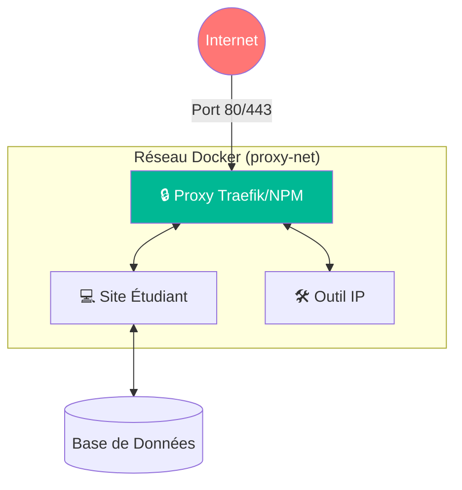
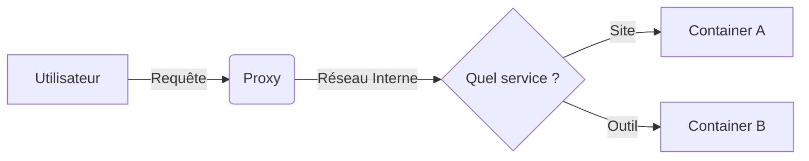

# 🌐 Réseautage Virtuel : Comment les dockers discutent ?

Dans Docker, chaque conteneur est comme une maison isolée. Pour qu'ils se parlent (ex: ton site parle à ta base de données), il faut les brancher sur le même réseau virtuel.

## Concept 1 : Le "Magic DNS" interne magic 🪄

C'est le super-pouvoir de Docker. Tu n'as jamais besoin de connaître l'adresse IP d'un conteneur.

**La Règle :** Le nom du service dans le `docker-compose.yml` devient son nom de domaine.

* Si ton service s'appelle `bdd-etudiants`.
* Ton site web peut juste faire : `ping bdd-etudiants`.
* Docker transforme automatiquement ce nom en la bonne IP.

---

## Concept 2 : Le Réseau Proxy (Le pont vers l'extérieur) 🌉

Pour ton projet, nous utilisons une architecture sécurisée.

1.  **Le réseau `proxy-net`** : C'est la zone publique. Seul le Proxy (Traefik/Nginx) et les conteneurs qui doivent être vus du web y sont connectés.
2.  **L'Isolation** : Si un conteneur n'est pas sur ce réseau, il est invisible depuis Internet.

---

## Les Commandes Clés 🛠️

Comment gérer ces réseaux manuellement si besoin ?

1. **`docker network create nom_du_reseau`** : Crée un nouveau câble virtuel.
2. **`docker network ls`** : Liste tous les réseaux disponibles sur ton Raspberry Pi.
3. **`docker network inspect nom_du_reseau`** : Montre quels conteneurs sont branchés dessus en ce moment.

### Résumé du flux de données :

---

### **Retour en arrière ->** [Homepage](https://snaky21.github.io/projet_m431_wiki/)