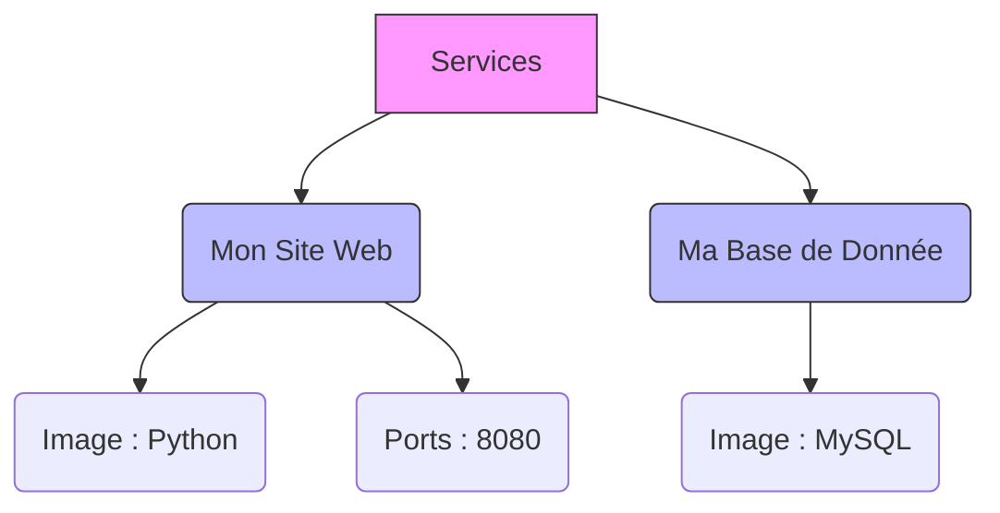
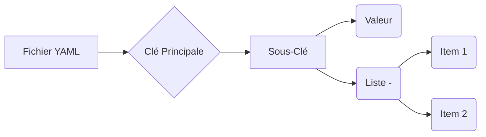

# 📝 YAML : La Recette de Cuisine du Code

Le YAML (`.yml`) n'est pas du code de programmation, c'est un format de **configuration**. C'est là que tu listes les ingrédients et les instructions pour Docker.

## Règle d'Or : L'Indentation (Les Espaces) 📏

En YAML, **les espaces définissent la hiérarchie**.
* Jamais de tabulations ! (Utilise la barre d'espace).
* Si c'est décalé vers la droite, c'est que ça appartient à la ligne du dessus.



---

## Concept 1 : Clé : Valeur 🔑

C'est la base. Tu donnes un nom (clé) et tu lui assignes une donnée (valeur).

* `image: python` -> Je veux l'image Python.
* `restart: always` -> Redémarre toujours.

---

## Concept 2 : Les Listes (Le tiret -) 📋

Quand tu vois un tiret `-`, cela signifie **"Il y en a plusieurs"**.

Par exemple, un conteneur peut avoir plusieurs "volumes" ou être connecté à plusieurs "réseaux".

* **Sans tiret** = C'est une propriété unique.
* **Avec tiret** = C'est un élément d'une liste.

---

## Exemple Concret (Ton docker-compose) 🧐

Regarde comment la structure en escalier organise tout :

```yaml
services:           # Niveau 1 : On parle des services
  mon-site:         # Niveau 2 : Le nom du service
    image: nginx    # Niveau 3 : L'image utilisée
    ports:          # Niveau 3 : Liste des ports
      - "80:80"     # Niveau 4 : Un élément de la liste

```

### Résumé visuel de la structure :



---

### **Retour en arrière ->** [Homepage](https://snaky21.github.io/projet_m431_wiki/)