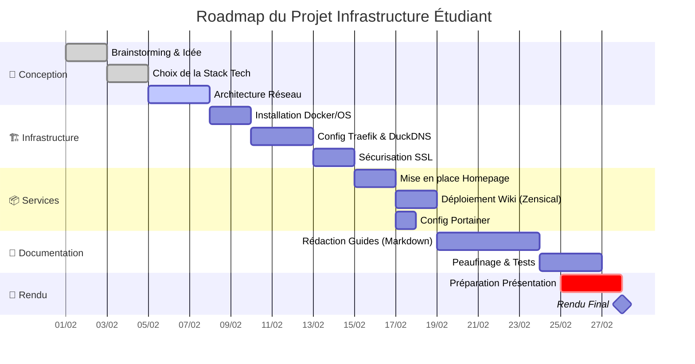

# 📅 Planification du Projet M431

Voici le déroulement prévisionnel de notre projet, de la conception à la livraison finale.

## 📌 Diagramme de Gantt

## 📋 Répartition des tâches

| Phase | Responsable(s) | Statut |
| --- | --- | --- |
| **Architecture** | Gabriel | ✅ Terminé |
| **Traefik & Réseau** | X | 🔄 En cours |
| **Homepage & Design** | X | ⏳ À faire |
| **Documentation** | X| ⏳ À faire |

---

> *Note : Ce planning est susceptible d'évoluer en fonction des contraintes techniques rencontrées.*